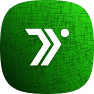
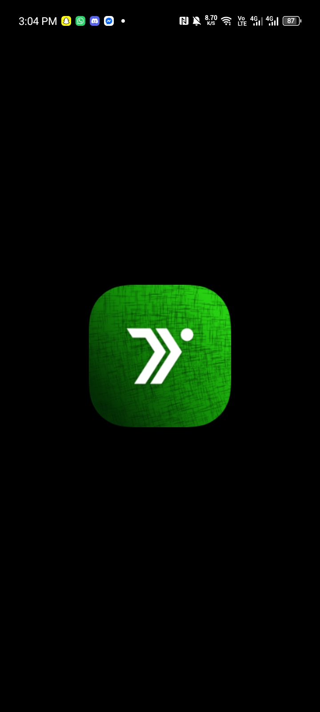
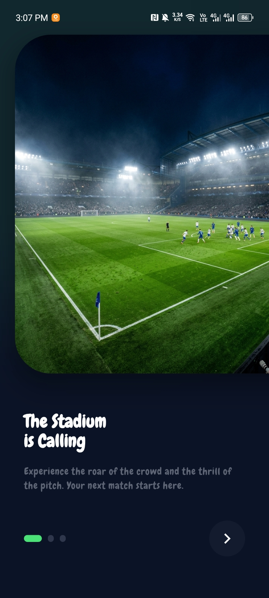
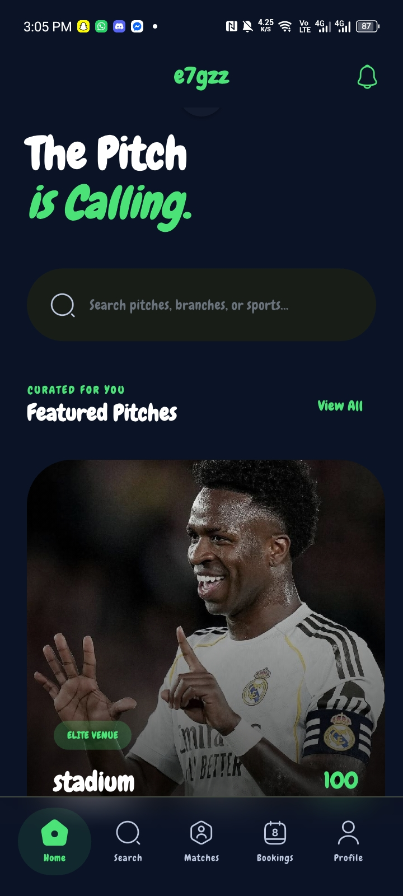
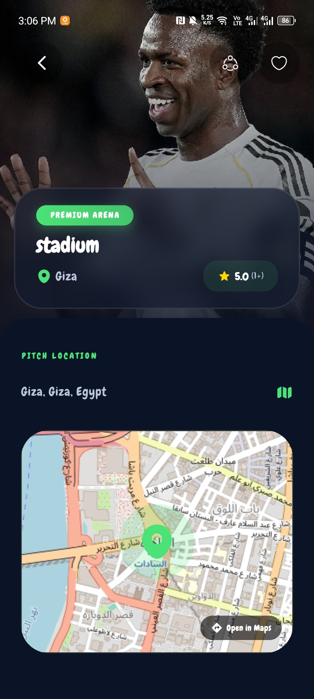
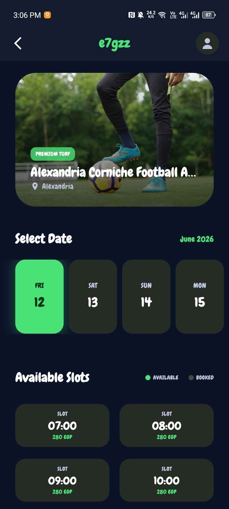
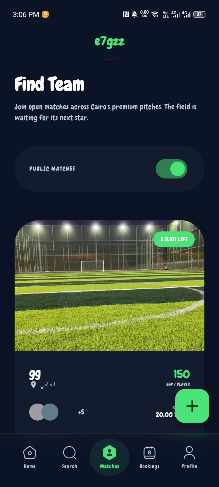
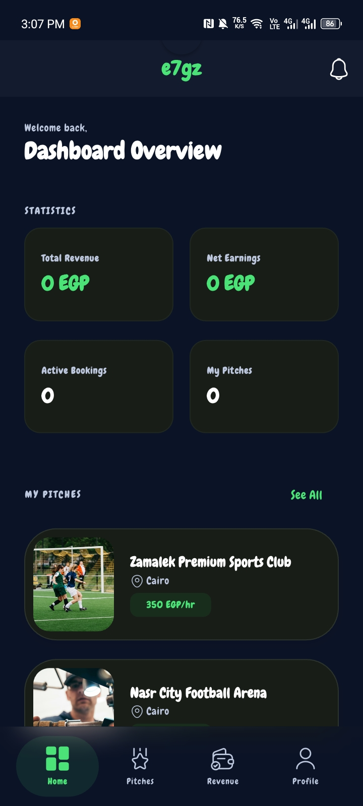
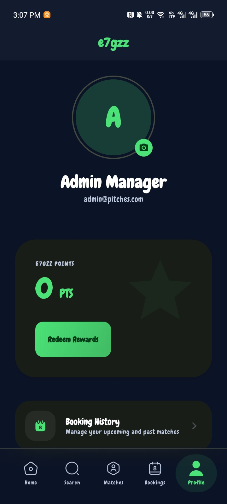
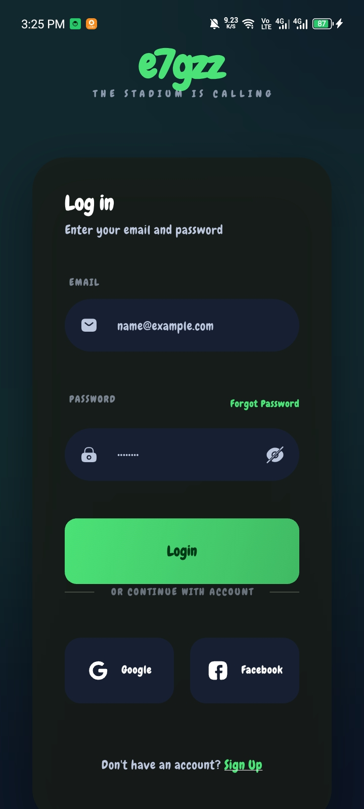

<div align="center">
  <!-- Replace with your actual app logo -->
  

  # E7gz (إحجز)

  **The ultimate platform for discovering football pitches, booking matches, and connecting with players.**

  [](https://flutter.dev/)
  [](https://dart.dev/)
  [](https://firebase.google.com/)
  [](https://opensource.org/licenses/MIT)

</div>

---

## 📖 App Overview

**E7gz** is a comprehensive mobile application built with Flutter that revolutionizes how players and pitch owners interact. Whether you're a player looking for a nearby football pitch, trying to join a team through matchmaking, or a pitch owner managing your venue's schedule, E7gz provides a seamless, real-time experience tailored for the sports community.

## ✨ Key Features

- **🏟️ Pitch Discovery & Booking**: Find top-rated pitches nearby, view details, and book your slot in a few taps.
- **🗺️ Interactive Maps**: Built-in map support (`flutter_map`) to browse fields by location and get directions.
- **🤝 Player Matchmaking**: Connect with local players, form teams, and join competitive matches effortlessly.
- **👨‍💼 Multi-Role Dashboards**: 
  - **Player View**: Browse, book, and chat.
  - **Pitch Owner View**: Manage venue listings, oversee incoming bookings, and track revenue.
  - **Admin View**: Platform-wide moderation and management.
- **🔔 Push Notifications**: Stay updated with booking confirmations, match reminders, and system alerts.
- **🔐 Secure Authentication**: Fast and reliable user onboarding using Firebase Auth.
- **✨ Fluid & Responsive UI**: Beautifully animated interfaces with `flutter_animate`, Skeleton loading states, and dynamic screen scaling (`flutter_screenutil`).
- **🌐 Localization**: Full support for Multi-Language.

---

## 📱 App Screens

<p align="center">
  <!-- 
    Replace these placeholder links with the actual paths or URLs to your screenshots 
    You can store your screenshots in a `docs/screenshots/` or `assets/screenshots/` folder.
  -->
  
  
  
  
  
</p>
<p align="center">
  
  
  
  
  
</p>

<p align="center">
  
  
</p>

---

## 🛠️ Technology Stack & Architecture

This project strictly follows **Clean Architecture** patterns combined with **Feature-First** modularization to ensure scalability, maintainability, and testability.

### Core Stack
- **Framework:** [Flutter](https://flutter.dev/)
- **State Management:** [Flutter BLoC](https://bloclibrary.dev/) (Cubit & BLoC)
- **Routing:** [GoRouter](https://pub.dev/packages/go_router)
- **Dependency Injection:** [GetIt](https://pub.dev/packages/get_it)
- **Functional Programming:** [fpdart](https://pub.dev/packages/fpdart) & [Equatable](https://pub.dev/packages/equatable)

### Network & Backend
- **Backend as a Service:** Firebase (Firestore, Auth, Storage, Analytics, Crashlytics, Realtime Database)
- **HTTP Client:** [Dio](https://pub.dev/packages/dio)

### UI & Styling
- **Animations:** [flutter_animate](https://pub.dev/packages/flutter_animate)
- **Responsiveness:** [flutter_screenutil](https://pub.dev/packages/flutter_screenutil)
- **Feedback & Loaders:** [skeletonizer](https://pub.dev/packages/skeletonizer)
- **Icons:** [iconsax_plus](https://pub.dev/packages/iconsax_plus), [cupertino_icons](https://pub.dev/packages/cupertino_icons)
- **Maps:** [flutter_map](https://pub.dev/packages/flutter_map), [latlong2](https://pub.dev/packages/latlong2)

---

## 📁 Project Structure

The project is structured by feature to encapsulate UI, business logic, and data layers intuitively.

```text
lib/
├── main.dart
├── src/
│   ├── app.dart                   # Global app configuration
│   ├── core/                      # Core utilities, routing, DI, network helpers, theming
│   ├── features/                  # Distinct App Modules
│   │   ├── admin/                 # Platform administration controls
│   │   ├── auth/                  # Login, registration, and session management
│   │   ├── bookings/              # Time slot reservations and booking history
│   │   ├── home/                  # Central hub and dashboard
│   │   ├── maps/                  # Map interfaces for discovering pitches
│   │   ├── matchmaking/           # Finding matches and players
│   │   ├── notifications/         # Real-time updates and alerts
│   │   ├── onboarding/            # First-time app launch experience
│   │   ├── owner/                 # Pitch owner/manager dashboards
│   │   ├── pitches/               # Browsing pitches, reviews, and details
│   │   ├── profile/               # User bio, settings, and stats
│   │   └── search/                # Deep search application-wide
│   └── extensions/                # Dart extension methods
└── assets/                        # Local images, SVG, icons, etc.
```

## 🚀 Getting Started

To get a local copy up and running, follow these simple steps.

### Prerequisites

- [Flutter SDK](https://docs.flutter.dev/get-started/install) (v3.10.8 or higher)
- [Dart SDK](https://dart.dev/get-dart)
- IDE Selection (VS Code, Android Studio, IntelliJ IDEA)

### Installation

1. **Clone the repository:**
   ```bash
   git clone https://github.com/your-username/e7gz_app.git
   cd e7gz_app
   ```

2. **Clean up and fetch dependencies:**
   ```bash
   flutter clean
   flutter pub get
   ```

3. **Environment Setup:**
   Ensure you have configured your environment (`.env`) file or Firebase credentials (`google-services.json` for Android / `GoogleService-Info.plist` for iOS).

4. **Run the App:**
   ```bash
   flutter run
   ```

## 🧪 Testing and Quality Control

Run tests to ensure everything is working correctly:
```bash
# Run unit and widget tests
flutter test

# Run static code analysis
flutter analyze
```

## 🤝 Contributing

Contributions are what make the open source community such an amazing place to learn, inspire, and create. Any contributions you make are **greatly appreciated**.

1. Fork the Project
2. Create your Feature Branch (`git checkout -b feature/AmazingFeature`)
3. Commit your Changes (`git commit -m 'Add some AmazingFeature'`)
4. Push to the Branch (`git push origin feature/AmazingFeature`)
5. Open a Pull Request

## 📄 License

Distributed under the MIT License. See `LICENSE` for more information.

---
*Created with ❤️ by the E7gz Development Team.*
